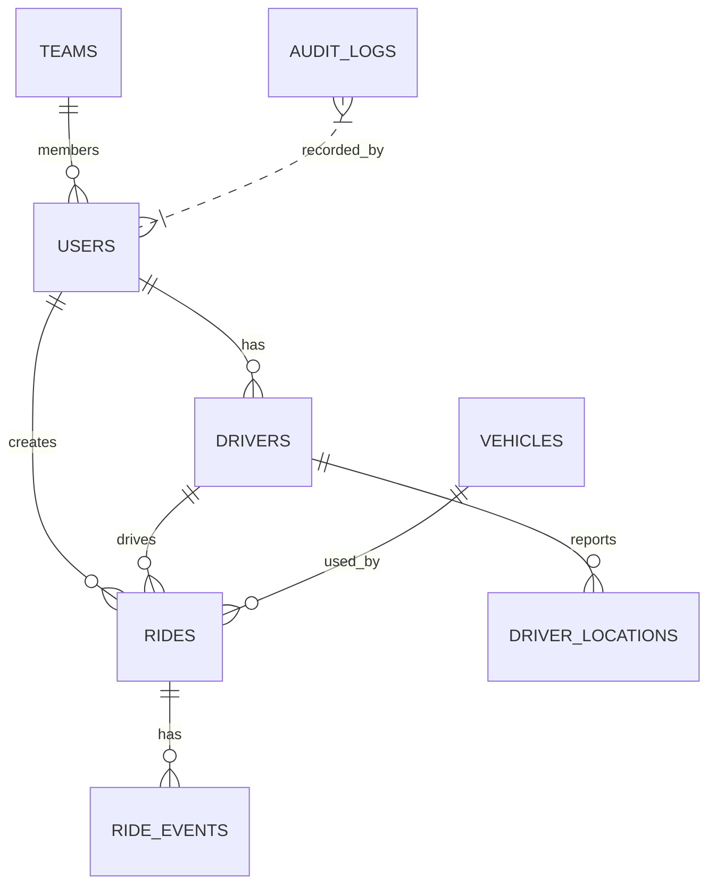

# EMS WeCare — Database Guide

เอกสารนี้อธิบายโครงสร้างข้อมูล (SQLite), แนวทางปฏิบัติสำหรับการสำรองข้อมูล/คืนค่า, การปรับจูนประสิทธิภาพ, การตรวจสอบความสมบูรณ์ของ audit chain, และขั้นตอนการย้ายไป Postgres สำหรับการใช้งานจริง

---

## สรุปภาพรวม
- ฐานข้อมูลหลักปัจจุบัน: SQLite (ไฟล์: `db/wecare.db`) ใช้ไลบรารี `better-sqlite3` ผ่าน `wecare-backend/src/db/sqliteDB.ts`
- Schema อยู่ใน: `wecare-backend/db/schema.sql`
- ตารางสำคัญ: `users`, `drivers`, `patients`, `rides`, `ride_events`, `driver_locations`, `vehicles`, `vehicle_types`, `teams`, `audit_logs`, `system_settings`

---

## ERD (Mermaid)


---

## Schema highlights & constraints
- `users.role` CHECK constraint: allowed roles (`DEVELOPER, ADMIN, OFFICER, RADIO, RADIO_CENTER, DRIVER, COMMUNITY, EXECUTIVE`) — server uses case-insensitive comparison
- `drivers.user_id` unique mapping to `users(id)` — driver profile associated to one user
- `rides.status` enum-like check: `PENDING, ASSIGNED, IN_PROGRESS, COMPLETED, CANCELLED`
- `audit_logs` stores `hash` and `previous_hash` เพื่อให้สามารถตรวจสอบความสมบูรณ์ของลำดับการบันทึก (blockchain-like)
- หลายฟิลด์จัดเก็บ JSON เป็น TEXT (e.g., `patients.patient_types`, `vehicles.features`) — ต้อง parse/validate ในแอป

---

## Indexes (มีอยู่แล้ว ใน `schema.sql`)
- `idx_users_email`, `idx_users_role`
- `idx_rides_status`, `idx_rides_appointment_time`, `idx_rides_driver_id`
- `idx_driver_locations_driver_id`, `idx_driver_locations_timestamp`
- Recommendation: ตรวจสอบ index cardinality ตามข้อมูลจริงก่อนเพิ่มเพิ่มเติม

---

## Backup and Restore (SQLite)
1. Consistent backup (online): ใช้ WAL checkpoint แล้วสำรองไฟล์
   - ขั้นตอนสั้น ๆ:
     - เรียก `PRAGMA wal_checkpoint(TRUNCATE)` หรือใช้ `sqlite3` CLI
     - ทำสำเนาไฟล์ `wecare.db` และสำรองไฟล์ `wecare.db-wal` ถ้าจำเป็น
2. Cold backup (off service): หยุดบริการ backend แล้วคัดลอก `db/wecare.db`
3. แนะนำเก็บไฟล์สำรองแบบ timestamped และโยกขึ้น storage ที่ปลอดภัย (S3, Azure Blob)

Sample PowerShell backup script (simple):

```powershell
$ts = Get-Date -Format "yyyyMMddHHmmss"
Stop-Process -Name node -ErrorAction SilentlyContinue
Copy-Item -Path "d:\EMS\db\wecare.db" -Destination "d:\backups\wecare-db-$ts.db"
# Start server manually after backup
```

Notes:
- Avoid copying while writer transactions active; use WAL checkpoint to flush.
- Verify restore by opening DB and running `SELECT 1`.

---

## Restore
- Replace existing `wecare.db` with backup copy (ensure backend stopped or DB closed), then start backend.
- After restore, run health checks: `SELECT COUNT(*) FROM users;`, `SELECT COUNT(*) FROM rides WHERE status='IN_PROGRESS';`

---

## Maintenance & Performance Tuning (SQLite)
- Use WAL mode (already enabled in `sqliteDB.ts`) for concurrency: good for many readers and one writer
- `busy_timeout = 5000` helps with write contention; consider raising if high concurrency
- `cache_size` set to -10000 (~10MB) — tune according to host memory
- Run `ANALYZE` after large data loads to update query planner stats
- Periodic `PRAGMA incremental_vacuum` or `VACUUM` during maintenance window
- Use transactions for multi-table updates (assigning rides should be atomic)
- Avoid long-running write transactions; batch updates where possible

---

## Audit Logs Integrity (hash chain)
- Schema includes `hash` and `previous_hash` for each audit entry
- To verify chain (example SQL pseudocode):

```sql
SELECT id, hash, previous_hash, details, timestamp
FROM audit_logs
ORDER BY sequence_number ASC;
```
- Compute SHA256 of each row content (consistent canonical serialization) and compare stored `hash`; also confirm `previous_hash` matches prior row's `hash`.
- Provide an admin endpoint to validate chain integrity and re-compute if necessary (DEVELOPER route exists to rebuild chain)

---

## Security & Access Control for DB
- Do NOT store DB file on publicly accessible filesystems
- Limit OS user permissions to DB file (only backend service account)
- Encrypt backups at rest (use server-side encryption in object storage)
- For production scaling, migrate to a server-grade RDBMS (Postgres) rather than SQLite

---

## Migration Path: SQLite → Postgres (recommended for production)
1. Prepare Postgres instance (version >= 14 recommended)
2. Translate schema types:
   - TEXT -> TEXT
   - DATETIME -> TIMESTAMP WITH TIME ZONE (or TIMESTAMP)
   - AUTOINCREMENT INTEGER -> SERIAL / BIGSERIAL
   - JSON fields -> use `JSONB` for `patients.patient_types`, `vehicles.features`, `teams.member_ids`
3. Create migration scripts (use `node-pg-migrate`, `knex`, or raw SQL files). Example steps:
   - Create tables in Postgres, apply constraints and indexes
   - Export SQLite data (CSV per table or use `sqlite3` to dump) and import into Postgres (`COPY` or `psql`)
4. Update backend DB layer:
   - Replace `better-sqlite3` usage with `pg` or an ORM (e.g., `knex`, `TypeORM`, `Prisma`)
   - Add connection pooling (pg Pool) and configure pool size according to CPU and memory
   - Update SQL dialect differences (LIMIT/OFFSET, date functions)
5. Migrate audit log hash verification logic (ensure canonical serialization consistent across DBs)
6. Run integration tests, compare counts and spot-check records

Tips:
- Migrate incremental: keep SQLite as read-only replica while cutting write traffic to Postgres during final sync
- Consider using `pgloader` for structured migration if available

---

## Sample queries (Diagnostics)
- Count rides by status:
```sql
SELECT status, COUNT(*) FROM rides GROUP BY status;
```
- Find active drivers with recent location:
```sql
SELECT d.id, d.full_name, dl.latitude, dl.longitude, dl.timestamp
FROM drivers d
JOIN driver_locations dl ON dl.driver_id = d.id
WHERE dl.timestamp > datetime('now','-5 minutes')
AND d.status = 'AVAILABLE';
```
- Audit log chain head:
```sql
SELECT id, sequence_number, hash, previous_hash, timestamp FROM audit_logs ORDER BY sequence_number DESC LIMIT 1;
```

---

## Seed data & test DB
- `sqliteDB.ts` has `seedData()` which seeds default users and one driver
- For staging, create larger dataset via scripts (generate patients, rides, drivers) and run `ANALYZE`

---

## Monitoring & Alerts
- Monitor DB file size and WAL growth
- Alert on frequent `database is locked` errors
- Monitor query latency and slow API endpoints (instrumentation in backend)
- Backup failures should alert on CI/CD or monitoring channel

---

## CI / Migrations checklist
- Add migration step to CI that runs SQL syntax checks and runs integration tests against a temporary Postgres instance (Docker)
- Back up current DB before running destructive migrations in staging
- Provide rollback scripts (reverse migration SQL)

---

## Files & Scripts to include in repo (recommended)
- `wecare-backend/db/schema.sql` (already present)
- `wecare-qa/db-guide.md` (this file)
- `wecare-qa/diagrams/*` (ERD and flowcharts)
- `wecare-qa/sql/sample-data/` (optional CSVs for import)
- `scripts/backup-db.ps1` and `scripts/restore-db.ps1` (automation)
- `migrations/` (if moving to Postgres, store migration SQL or JS here)

---

## Next actions I can do for you
- สร้างตัวอย่างสคริปต์สำรอง/คืนค่า (`scripts/backup-db.ps1`, `scripts/restore-db.ps1`) และทดสอบกับไฟล์ DB ที่ใช้ใน repo
- สร้างชุด migration ตัวอย่างไปยัง Postgres (DDL + sample `node-pg-migrate` script)
- สร้าง `wecare-qa/sql/sample-data/` CSV samples สำหรับการทดสอบ import

บอกผมว่าต้องการให้ผมทำขั้นตอนใดต่อ (เลือกอย่างใดอย่างหนึ่ง):
- "สร้างสคริปต์สำรอง/คืนค่า"
- "สร้างตัวอย่าง migration ไป Postgres"
- "สร้างตัวอย่างไฟล์ข้อมูล (CSV)" 

ผมจะดำเนินการต่อทันทีและอัปเดต TODO list ครับ
